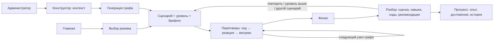
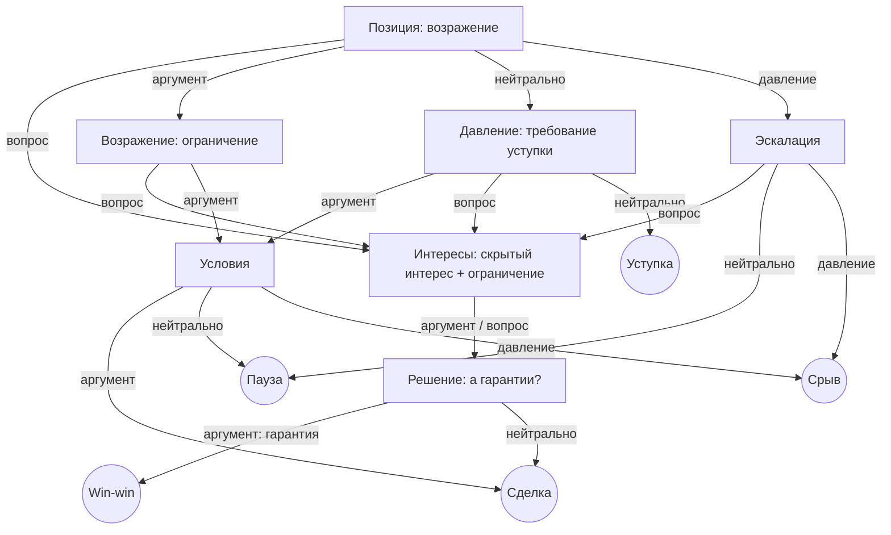

# ТАКТ — Арена переговоров

Интерактивный симулятор деловых переговоров. Участник ведёт разговор с виртуальным собеседником, каждая реплика меняет доверие, аргументацию и напряжение и уводит сценарий в свою ветку — к одному из пяти финалов. После встречи он получает разбор каждого хода. Администратор настраивает контекст (сферу, тему, сложность, тон, роль и цели собеседника), и генератор собирает под эти настройки сценарий с ветвлением.

Решение для кейса «Арена переговоров» (ОЭЗ ППТ «Алабуга») хакатона «Лидеры цифровой трансформации 2026».

---

## Содержание

1. [Быстрый старт](#1-быстрый-старт)
2. [Сценарий демонстрации (5 минут)](#2-сценарий-демонстрации-5-минут)
3. [Аудитория, проблема и ценность](#3-аудитория-проблема-и-ценность)
4. [Границы MVP](#4-границы-mvp)
5. [Путь пользователя](#5-путь-пользователя)
6. [Механики симуляции](#6-механики-симуляции)
7. [Сценарии и ветвление](#7-сценарии-и-ветвление)
8. [Конфигурируемость: кабинет администратора](#8-конфигурируемость-кабинет-администратора)
9. [Архитектура](#9-архитектура)
10. [ИИ (необязательно)](#10-ии-необязательно)
11. [Технологии, библиотеки и сервисы](#11-технологии-библиотеки-и-сервисы)
12. [Проверки и деплой](#12-проверки-и-деплой)

---

## 1. Быстрый старт

**Требования:** Node.js 18+ (проверено на 24) и npm. Для игры нужен любой современный браузер. Голосовой ввод работает в Chrome и Edge.

```bash
npm ci          # установка зафиксированных зависимостей (package-lock.json)
npm run dev     # http://localhost:5173
```

Продакшн-сборка и локальный просмотр:

```bash
npm run build   # статические файлы в dist/
npm run preview # http://localhost:4173
```

**Ключи и переменные окружения не нужны.** Приложение целиком работает в браузере: анализ реплик, ветвление, обратная связь и прогресс считаются офлайн. ИИ подключается по желанию. Бесплатный вариант — локальная модель через Ollama: её тренажёр находит сам (раздел 10).

Данные (свои сценарии, история, опыт, настройки ИИ) хранятся в `localStorage` и сохраняются после перезагрузки страницы и перезапуска сервера. Сброс: «Мой прогресс → Очистить» или очистка данных сайта.

## 2. Сценарий демонстрации (5 минут)

1. **Главная** → блок «Как это работает» объясняет путь из четырёх шагов.
2. **Кабинет администратора** (кнопка «Кабинет» в шапке) → вкладка **«Конструктор»**:
   - выберите сферу, например «Клиентский сервис»: поля заполнятся шаблоном;
   - поменяйте тон собеседника на «Конфликтный» и посмотрите, как меняется предпросмотр графа справа (7 этапов, 28 развилок, 5 финалов);
   - нажмите **«Сохранить и запустить»**.
3. **Подготовка** → режим «Вопрос-ответ», уровень «Новичок» → «Начать переговоры». Выбирайте реплики: после каждой показываются реакция собеседника, изменение метрик, разбор хода и более сильный вариант.
4. **Разбор** → оценка, диаграмма из 9 навыков, достигнутый финал среди пяти возможных, путь по графу, разбор каждого хода и рекомендации.
5. **«Другой сценарий»** → режим **«Диалог»**, авторский сценарий «Переговоры о цене». Пишите реплики сами. Для сравнения:
   - «Это ваши проблемы, скидок не будет!» → давление, напряжение растёт, собеседник закрывается;
   - «Чтобы ответить точно: с чем вы сравниваете и что для вас важнее — срок или бюджет?» → собеседник раскрывает интересы;
   - «Предлагаю: первый этап к марту укладываем в 4,2 млн, срок фиксируем в договоре со штрафом» → движение к взаимовыгодной сделке.
6. **«Мой прогресс»** → опыт, ранг, достижения, зоны роста и история. Перезагрузите страницу: данные на месте.
7. *(необязательно)* **Онлайн**: видеовстреча, собеседник говорит голосом, отвечать можно голосом.
8. *(необязательно, если установлена Ollama — раздел 10)* на экране разбора нажмите **«Получить разбор»** — ИИ-тренер разберёт ваши реплики. В конструкторе попробуйте **«Сгенерировать с ИИ»**.

## 3. Аудитория, проблема и ценность

**Для кого:**

| Аудитория | Задача |
|---|---|
| Менеджеры по продажам и закупщики | Торг о цене, продление контрактов, отсрочки платежа |
| Руководители проектов | Сроки, объём работ, эскалации заказчика |
| Сотрудники клиентского сервиса | Конфликты и жалобы, удержание клиента |
| Соискатели и сотрудники | Собеседования, обсуждение зарплаты |
| HR и L&D, вузы | Корпоративный тренажёр soft skills, модуль курса, оценка компетенций |

**Проблема.** Переговорам учат лекциями и чек-листами. Ролевые игры с тренером работают, но дорого стоят и плохо масштабируются: у участника мало попыток, и он редко получает разбор *своих* формулировок. Теория (Гарвардский метод, BATNA, SPIN) без практики не превращается в навык.

**Чем «Арена» лучше привычных форматов:**

- **Безопасная практика в любое время и без ограничения попыток:** ошибку можно повторить и увидеть, к чему приводит другой ход.
- **Исход зависит от формулировок**, а не только от выбора варианта: анализатор оценивает каждую свободную реплику.
- **Разбор каждого хода** с конкретной альтернативой («сильнее было бы так»), а не общая оценка «хорошо/плохо».
- **Один тренажёр под разные задачи:** администратор за пять минут собирает сценарий под свой отдел.
- **Работает без интернета и ключей**, поэтому демо не зависит от внешних сервисов.

## 4. Границы MVP

**Реализовано:**

- 4 режима тренировки: «Вопрос-ответ», «Диалог» (свободный текст и голос), «Онлайн» (видеовстреча с озвучкой), «Фразы» (сборка формулировки с «ловушками»).
- 7 сценариев: 2 авторских с ручной проработкой графа и 5 собранных генератором. Плюс неограниченное число своих.
- Кабинет администратора: конструктор с шаблонами по 8 сферам, предпросмотр графа, редактирование, копирование, удаление, импорт и экспорт в JSON.
- Офлайн-анализатор русских реплик и детерминированный движок ветвления.
- 3 уровня сложности и 4 тона собеседника, которые реально меняют механику.
- Подробный разбор, диаграмма навыков, рекомендации, опыт, ранги, 8 достижений, история и динамика.
- Необязательный ИИ: бесплатная локальная модель через Ollama с автоопределением, а также Claude и OpenAI-совместимые API. Функции: разбор от ИИ-тренера, генерация сюжета, живые реплики собеседника.
- Адаптивная вёрстка (мобильная и десктопная).

**Что можно развить:**

- Серверная часть: учётные записи, назначение сценариев группам, сводные отчёты для HR (сейчас данные хранятся локально в браузере).
- Визуальный редактор графа с произвольной топологией (сейчас генератор строит типовую топологию, а авторские графы задаются кодом).
- ML-классификатор реплик вместо эвристик, анализ интонации в голосовом режиме.
- Мультиязычность, SCORM/LTI-экспорт для LMS.

## 5. Путь пользователя



## 6. Механики симуляции

### Метрики

Три метрики от 0 до 100: **аргументация**, **доверие** и **напряжение**. Стартовые значения задаёт тон собеседника: у конфликтного доверие 30 и напряжение 65, у дружелюбного — 60 и 20.

### Типы ходов

Любой ход относится к одному из четырёх типов. Каждый узел графа содержит по одной ветке на каждый тип:

| Тип | Что это | Типичный эффект |
|---|---|---|
| Уточняющий вопрос | Выясняет интересы, стоящие за позицией | Доверие ↑, напряжение ↓, открывает скрытые интересы |
| Аргумент / предложение | Факт, предложение, обязательство | Аргументация ↑, продвижение к решению |
| Нейтральный ответ | Вежливо, но без содержания | Мало влияет, чаще ведёт к уступке или паузе |
| Давление | Ультиматум, оценочные слова | Доверие ↓, напряжение ↑, эскалация |

### Анализатор реплик (`src/lib/arena/analyzer.ts`)

В режимах «Диалог» и «Онлайн» анализатор разбирает текст игрока на сигналы:

- вопрос (знак «?» или вопросительное слово в начале);
- факты и цифры: числа, %, ₽, сроки, кейсы;
- предложение: «предлагаю», «давайте», «этап», «в обмен», «если… то»;
- обязательство: «зафиксируем», «в договоре», «гарантирую», «штраф», «еженедельный отчёт»;
- эмпатия и вежливость: «понимаю», «ваши опасения», «спасибо»;
- давление: «ваши проблемы», «не обсуждается», «или… или», «!!!», КАПС;
- слова без обязательств: «наверное», «постараемся», «обычно», «что-нибудь»;
- релевантность теме: совпадение с ключевыми словами сценария.

По сигналам анализатор определяет **тип хода** (он выбирает ветку графа) и выставляет **оценки ясности, убедительности, эмпатии и релевантности**. Качество формулировки работает как множитель от 0,5 до 1,35 к изменению метрик, поэтому два хода одного типа дают разный результат. Кроме того, анализатор формирует до трёх советов по конкретной реплике.

В режиме «Вопрос-ответ» варианты ответа прогоняются через тот же анализатор, поэтому шкала оценок во всех режимах одна.

### Уровни сложности

| | Новичок | Практик | Эксперт |
|---|---|---|---|
| Положительные изменения | ×1,2 | ×1 | ×0,85 |
| Штрафы | ×0,75 | ×1 | ×1,35 |
| Подсказки | без ограничений | 3 на сессию | −5 баллов за каждую |
| Таймер хода | нет | 90 с | 60 с |
| Разбор хода | сразу | сразу | только в итоговом отчёте |
| Множитель опыта | ×1 | ×1,5 | ×2 |

Если время хода вышло, пауза засчитывается как нейтральный ответ со штрафом к напряжению.

### Итоговая оценка

`балл = 0,4·финал + 0,2·аргументация + 0,25·доверие + 0,15·(100 − напряжение) − штраф за подсказки`

Вес финала: win-win 100, сделка 80, уступка 55, пауза 35, срыв 10. Оценка по шкале A–E. Если игрок пришёл к финалу «win-win» с доверием ниже 50, результат понижается до «договорённости без запаса доверия».

Диаграмма из 9 навыков считается по фактическим репликам: убедительность, ясность, деловой тон, эмпатия, доля вопросов, работа с возражениями, стратегия (финал и релевантность), контроль эмоций (напряжение и число агрессивных ходов), достижение цели.

### Геймификация

- **Опыт** = балл × множитель уровня. 5 рангов: от «Стажёра» до «Мастера переговоров».
- **8 достижений:** «Win-win», «Холодная голова» (ни одного агрессивного хода), «Сократ» (3 вопроса за сессию), «Укротитель» (договориться с конфликтным собеседником) и другие.
- **Зоны роста** — средние значения навыков за последние 5 сессий; **динамика баллов** — график по всем сессиям.
- Быстрые действия после разбора: «Повторить», «Следующий уровень», «Другой сценарий».

## 7. Сценарии и ветвление

Сценарий — это направленный граф (`ScenarioGraph`). Узел содержит реплику собеседника, этап, эмоцию, процент продвижения к цели и 4 варианта ответа (по одному на тип хода); каждый вариант указывает на следующий узел. Финальные узлы несут исход (`winwin | deal | concession | postponed | fail`). Если игрок сделал 8 ходов и не дошёл до финала, исход определяется по метрикам.

### Авторские сценарии

- **«Переговоры о цене»** (продажи; 17 узлов, жёсткий закупщик). Цена на 20% выше конкурентов. Лучший путь: выяснить основу сравнения и настоящий интерес (запуск к марту), предложить поэтапную оплату и закрыть прошлый негативный опыт клиента гарантией в договоре.
- **«Собеседование и обсуждение зарплаты»** (HR; 12 узлов, деловой собеседник). Игрок учится не отдавать право первой цифры, корректно использовать BATNA и предлагать оплату за результат.

### Сценарии из генератора (`src/lib/arena/generator.ts`)

Генератор строит граф по модели Гарвардского метода: **позиция → интересы → варианты → гарантии**.



Реплики собираются из «слотов», которые задаёт администратор: возражение, скрытый интерес, ограничение, требование уступки, предложение игрока, сильный факт, гарантия. Тон меняет вступление, реплики эскалации и ремарки собеседника. Встроенные сценарии из генератора: сроки проекта, конфликт с клиентом, условия партнёрства, защита бюджета, продление контракта.

`npm run check` проверяет каждый граф: все ссылки существуют, нет недостижимых узлов, в каждом узле есть 4 разных типа ответа и достижимы как минимум 4 разных финала.

## 8. Конфигурируемость: кабинет администратора

Кабинет открывается кнопкой «Кабинет» в шапке. В нём три вкладки.

**Сценарии:** список всех сценариев с типом («Авторский», «Из генератора», «Свой»), просмотр графа, копия встроенного сценария для доработки, редактирование и удаление своих, импорт и экспорт в JSON (так сценарий можно передать коллегам).

**Конструктор** — что задаёт администратор и на что это влияет:

| Параметр | Влияние |
|---|---|
| Сфера | Шаблон полей; фильтр сценариев у участника |
| Тема, роль и цель игрока | Реплики, брифинг, ключевые слова для оценки релевантности |
| Сложность по умолчанию | Уровень, который выбирается вместе со сценарием |
| Имя, роль, компания собеседника | Карточка и «видеовстреча» |
| **Тон собеседника** | Стартовые метрики, множители реакций, вступление и реплики эскалации, ремарки |
| Цели собеседника | Роль собеседника для ИИ; брифинг |
| 7 сюжетных слотов | Текст всех узлов графа и финалов |
| Брифинг | Факты, которые игрок видит перед стартом |

Предпросмотр графа обновляется при каждом изменении. Кнопка «Сгенерировать с ИИ» заполняет сюжетные слоты по сфере, теме и целям (если ИИ подключён).

**ИИ:** выбор провайдера, ключа и модели, проверка подключения (раздел 10).

## 9. Архитектура

Одностраничное приложение без сервера. Логика симуляции написана чистыми функциями на TypeScript и отделена от React.

```
src/
  lib/arena/
    types.ts        — типы: сценарий, граф, ход, анализ, результат
    scenarios.ts    — 2 авторских графа + 5 сценариев из генератора
    generator.ts    — генератор графа из контекста + шаблоны по сферам
    analyzer.ts     — офлайн-анализатор реплик на русском
    engine.ts       — применение хода, модификаторы уровня и тона, финалы, скоринг, рекомендации
    storage.ts      — localStorage (сценарии, история, настройки ИИ), ранги и достижения
    llm.ts          — необязательный ИИ-слой (Anthropic SDK / OpenAI-совместимый API)
  lib/simulator-data.ts — справочники: режимы, уровни, тоны, сферы, оси навыков
  hooks/
    use-simulator.tsx    — глобальное состояние приложения (экран, выбор, данные)
    use-negotiation.ts   — состояние одной сессии по графу + таймер хода
    use-chat-session.ts  — свободный диалог: анализ → ветка → ответ (с ИИ или без)
    use-speech.ts        — Web Speech API: распознавание и озвучка
  components/simulator/  — экраны: Home, Setup, Quiz, Dialog, Online, Phrases, Result, Admin, Profile
scripts/check-scenarios.ts — проверка графов и анализатора
```

**Поток одного хода:** реплика → `analyzeText` → тип хода и оценки → `resolveMove` выбирает ветку узла и масштабирует изменение метрик (уровень × тон × качество формулировки) → новый узел → (при включённом ИИ) `partnerReply` переформулирует реплику узла под слова игрока → после финала `buildResult` собирает отчёт.

**Почему так:** ветвление и оценка детерминированы и воспроизводимы, поэтому одинаковые ходы дают одинаковый исход, а демо не зависит от сети. ИИ используется только там, где он улучшает опыт (естественность реплик, развёрнутый коучинг, помощь автору сценария), и не влияет на механику.

## 10. ИИ (необязательно)

Всё основное работает без ИИ. ИИ добавляет три функции:

1. **Разбор от ИИ-тренера** на экране результатов: что получилось, что улучшить и переформулированные реплики игрока.
2. **Генерация сюжета** в конструкторе администратора по сфере, теме и целям собеседника.
3. **Живые реплики собеседника** в «Диалоге» и «Онлайне»: модель переформулирует реплику сценария, откликаясь на слова игрока. Ветка и метрики всегда задаются движком.

Настраивается в «Кабинет → ИИ». Есть три варианта подключения.

| Провайдер | Стоимость | Что нужно | Модель по умолчанию |
|---|---|---|---|
| **Ollama (локально)** — рекомендуется | Бесплатно | Установить Ollama и скачать модель (ниже) | `qwen2.5:3b` |
| **OpenAI-совместимый** | Есть бесплатные модели | Свой ключ [OpenRouter](https://openrouter.ai/) (модели с суффиксом `:free`), LM Studio, vLLM и др. | `openai/gpt-4o-mini` |
| **Claude (Anthropic)** | Платно | API-ключ с [console.anthropic.com](https://console.anthropic.com/) | `claude-opus-5` |

> **Почему в репозитории нет готового ключа.** Код решения открытый, а любой ключ в открытом репозитории становится публичным: его используют посторонние, и провайдер его блокирует. Поэтому бесплатный вариант по умолчанию — локальная модель: ей не нужны ни ключ, ни интернет.

### Бесплатный локальный ИИ: Ollama + Qwen 2.5

[Ollama](https://ollama.com/) запускает открытые модели на своём компьютере и отдаёт OpenAI-совместимый API на `http://localhost:11434`. Модель [Qwen 2.5 3B](https://ollama.com/library/qwen2.5) (≈1,9 ГБ) хорошо понимает русский и работает даже на ноутбуке.

**1. Установите Ollama.**

- **Windows:** `winget install Ollama.Ollama` или установщик с [ollama.com/download](https://ollama.com/download). Сервер запускается автоматически (иконка в трее).
- **macOS:** `brew install ollama` или приложение с [ollama.com/download](https://ollama.com/download).
- **Linux:** `curl -fsSL https://ollama.com/install.sh | sh`

**2. Скачайте модель** (один раз, ≈1,9 ГБ):

```bash
ollama pull qwen2.5:3b
```

Проверка: `ollama list` показывает модель, а по адресу `http://localhost:11434` открывается «Ollama is running».

**3. Запустите тренажёр локально** (`npm run dev`). Приложение само найдёт Ollama и покажет уведомление «Найдена локальная модель»: разбор от ИИ-тренера и генерация сюжета уже включены. Ничего настраивать не нужно. Автоопределение работает только при открытии на `localhost` и только пока ИИ не настроен вручную в кабинете.

Вручную: «Кабинет → ИИ → Ollama (локально)» → «Найти модели» → выберите модель → «Проверить подключение» → «Сохранить».

**Производительность (измерено на ноутбуке с RTX 3050 4 ГБ и 16 ГБ ОЗУ):**

| Модель | Размер | Разбор ИИ-тренера | Генерация сюжета | Примечание |
|---|---|---|---|---|
| `qwen2.5:3b` | 1,9 ГБ | ≈10 с | ≈4 с | Целиком помещается в 4 ГБ видеопамяти. **Рекомендуется** |
| `qwen2.5:7b` | 4,7 ГБ | ≈50 с | ≈16 с | При нехватке видеопамяти медленнее и иногда переходит на китайский |

Без видеокарты модель работает на процессоре: примерно в 3–5 раз медленнее, но работает. С 8 ГБ видеопамяти и больше стоит попробовать `qwen2.5:7b` или `qwen2.5:14b`.

**Живые реплики на локальной модели** по умолчанию выключены: модели на 3–7 млрд параметров иногда искажают смысл реплики или путают род. Их можно включить в кабинете переключателем «Живые реплики собеседника». Ответы с иероглифами, латиницей или слишком длинные отбрасываются фильтром, и вместо них показывается реплика сценария. У облачных моделей переключатель включён по умолчанию.

**Если Ollama не находится:**

| Симптом | Решение |
|---|---|
| «Ollama не найдена» | Запущен ли сервер? Откройте `http://localhost:11434`. Если нет: `ollama serve` |
| «Моделей нет» | `ollama pull qwen2.5:3b` |
| Тренажёр открыт не с `localhost` (например, с Vercel) | Браузер блокирует запрос из-за CORS. Перезапустите Ollama с разрешённым источником: Windows — `setx OLLAMA_ORIGINS "*"` и перезапуск Ollama из трея; macOS — `launchctl setenv OLLAMA_ORIGINS "*"`; Linux — `OLLAMA_ORIGINS="*" ollama serve`. Страница на HTTPS может блокировать обращения к `http://localhost` — надёжнее запускать тренажёр локально |
| Первый ответ долгий | Модель загружается в память, это 5–15 с. Дальше ответы быстрые |

### Как устроены запросы

- Ollama и OpenAI-совместимые API: `POST /v1/chat/completions`. Для генерации сюжета включается JSON-режим (`response_format: json_object`), а ключи ответа нормализуются: малые модели пишут `hidden_interest` вместо `hiddenInterest`.
- Claude: официальный SDK `@anthropic-ai/sdk`. Он загружается лениво, только при включённом ИИ, с `effort: low` и серверным фолбэком на другую модель.
- Ключи облачных провайдеров вводятся в интерфейсе и хранятся только в `localStorage` браузера. Переменные окружения не используются.
- При любой ошибке (сеть, ключ, CORS, таймаут, фильтр качества) тренажёр показывает уведомление и продолжает работать на репликах сценария.

> Вызов облачного API из браузера подходит для демо и самостоятельного использования. Для корпоративного развёртывания ключ нужно перенести на серверный прокси.

## 11. Технологии, библиотеки и сервисы

| Что | Зачем |
|---|---|
| [React 18](https://react.dev/) + [TypeScript](https://www.typescriptlang.org/) | Интерфейс и типобезопасная логика |
| [Vite](https://vite.dev/) (rolldown-vite) | Сборка и dev-сервер |
| [Tailwind CSS](https://tailwindcss.com/) + [shadcn/ui](https://ui.shadcn.com/) (Radix UI) | Дизайн-система, доступные компоненты |
| [Recharts](https://recharts.org/) | Диаграмма навыков, динамика баллов |
| [lucide-react](https://lucide.dev/) | Иконки |
| [sonner](https://sonner.emilkowal.ski/) | Уведомления о ходе |
| Web Speech API (встроен в браузер) | Голосовой ввод (Chrome/Edge) и озвучка собеседника |
| [Ollama](https://ollama.com/) + [Qwen 2.5](https://ollama.com/library/qwen2.5) | Бесплатный локальный ИИ (необязательно) |
| [@anthropic-ai/sdk](https://github.com/anthropics/anthropic-sdk-typescript) | Необязательный ИИ-режим (Claude) |
| [tsx](https://tsx.is/) | Запуск скрипта проверки сценариев |

Методическая основа: Гарвардский метод переговоров (интересы вместо позиций, объективные критерии, взаимная выгода), BATNA (альтернатива в сценарии о зарплате), вопросы в духе SPIN (выявление ситуации и потребности перед предложением).

Изображения собеседника и пользователя загружаются с CDN `cdn.poehali.dev`. Сценарии без фото показывают аватар с инициалами.

## 12. Проверки и деплой

```bash
npm run typecheck  # проверка типов TypeScript
npm run check      # целостность всех графов сценариев и контрольные примеры анализатора
npm run lint       # ESLint
```

**Деплой.** Приложение статическое: `npm run build` → папка `dist/` публикуется на любом статическом хостинге. Для Vercel, Netlify и Render: команда сборки `npm run build`, папка публикации `dist`, переменные окружения не нужны.
